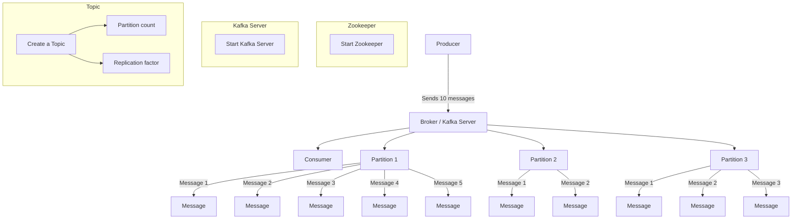

# KAFKA

---

## Pre-requisites

1. install apache kafka (open source) or confluent kafka (commercial distribution)
    - Important Dirs:
        - "E:\kafka\bin\windows"
        - "E:\kafka\config"
2. install kafka offset explorer (visualiser)
    - connect by creating a new cluster
        - give cluster name
        - enable zookeeper access
        - provide zookeeper host and port
3. install docker

## KAFKA CLI - 101

### Kafka Producer-Consumer Flow Steps:

1. **Start Zookeeper**
    - The default port of zookeeper is **2181**

```shell
.\bin\windows\zookeeper-server-start.bat .\config\zookeeper.properties
```

2. **Start Kafka Server**
    - The default port of kafka server/broker is **9092**

```shell
.\bin\windows\kafka-server-start.bat .\config\server.properties
```

3. **Create a Topic**

    - The default port of kafka server/broker is **9092**

```shell
.\bin\windows\kafka-topics.bat --bootstrap-server localhost:9092 --create --topic my-1st-topic --partitions 3 --replication-factor 1
.\bin\windows\kafka-topics.bat --bootstrap-server localhost:9092 --create --topic my-2nd-topic --partitions 3 --replication-factor 1
```

```shell
.\bin\windows\kafka-topics.bat --bootstrap-server localhost:9092 --list
.\bin\windows\kafka-topics.bat --bootstrap-server localhost:9092 --describe --topic <topicName>
```

- **Partition count**
- **Replication factor**



4. To start the producer using CLI

```shell
.\bin\windows\kafka-console-producer.bat --broker-list localhost:9092 --topic my-1st-topic
```

```shell
Get-Content E:\Coding\the-kafka-project\src\main\resources\csv\customers-10000.csv | .\bin\windows\kafka-console-producer.bat --broker-list localhost:9092 --topic my-1st-topic
```

5. To start the consumer using CLI

```shell
.\bin\windows\kafka-console-consumer.bat --bootstrap-server localhost:9092 --topic my-1st-topic --from-beginning
```

## KAFKA using Docker

```shell
docker compose -f .\docker\docker-compose.yml up -d
```

- For using the bash inside the kafka container
```shell
docker exec -it <kafka_container_name> bash
```